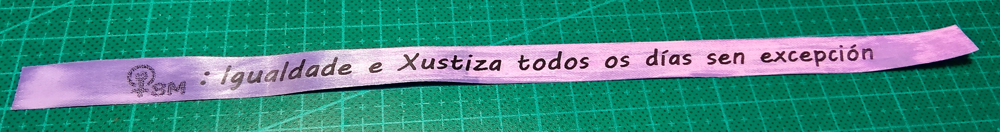

# Pulseiras-Tematicas
Spreadsheet for themed custom bracelets

This spreadsheet file contains an Excel template to create the custom bracelets using a label printer. The row heigth is designed for 12mm satin ribbon tape and each row is a different bracelet which will be printet sequentially. You can add images like in the example, but please not that for optimal results they should be converted first to pure black and white.

**[ Custom colors ]**

For most label printers there are satin ribbon cartridges of different colors, but if you do not find the desired one you can just use the white one and then apply color using fabric tint or acrylic paint.

| Before | After |
| ------ | ----- |
|  |  |

**[ Excel File ]**

Here you can download the template file:

<a href="Cintas.xlsx">Cintas.xlsx</a>

**[ Demo video ]**

Video showing the project and the instructions to create the ribbon bracelets:

https://www.youtube.com/watch?v=none
